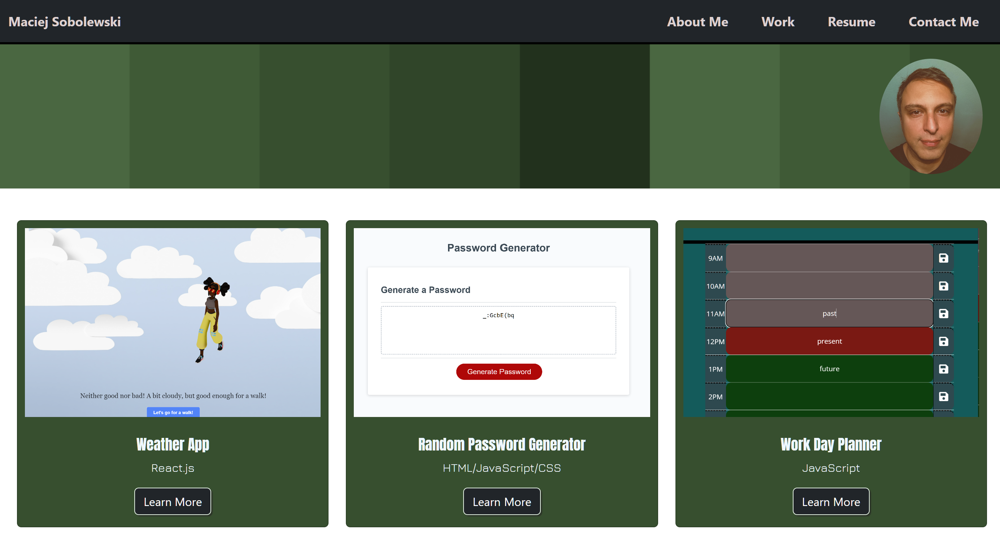

# responsive-portfolio-bootstrap
Responsive portfolio-html-bootstrap-custom css

Portfolio page, which I can add to as the course progresses

## The URL of the deployed website.

[Portfolio](https://sobolewskimaciej.github.io/responsive-portfolio-bootstrap/)

## Screenshot of deployed website.

Pictures provided by EdX Front end development bootcamp.

Icons provided by:
Font Awesome Free 6.5.1 by @fontawesome - https://fontawesome.com 
License - https://fontawesome.com/license/free (Icons: CC BY 4.0, Fonts: SIL OFL 1.1, Code: MIT License)

